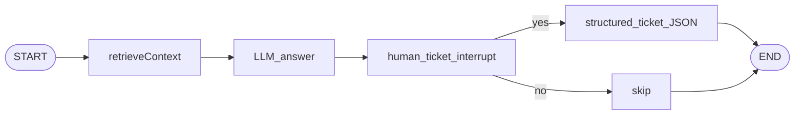

# LangChain / LangGraph 学习仓库（TypeScript）

面向前端背景的阶段性示例：**LangChain.js 1.x** + **@langchain/langgraph 1.x**，需 **Node 20+** 与 OpenAI 兼容 API。

## 环境

```bash
cp .env.example .env
# 填写 OPENAI_API_KEY；若用中转，配置 OPENAI_BASE_URL
npm install
```

可选：在 `.env` 中开启 `LANGCHAIN_TRACING_V2=true` 与 `LANGCHAIN_API_KEY`，在 [LangSmith](https://docs.langchain.com/langsmith) 查看 trace。

## 脚本一览

| 命令 | 说明 |
|------|------|
| `npm run prereq:hello` | 直连 HTTP 的最小 Chat Completions（流式/非流式） |
| `npm run phase1:chat` | 多轮 CLI + `github_repo_lookup` 工具 + 流式 tool 循环 |
| `npm run phase1:structured` | `withStructuredOutput`（Zod） |
| `npm run phase2:approval` | LangGraph：起草 → 质检 → 条件边改写（`MemorySaver`） |
| `npm run phase3:research` | Wikipedia 检索 → 写报告 → **`interrupt` HITL** 确认「发布」 |
| `npm run phase4:sse` | **SSE**：`POST /api/stream/approval`（图 updates）、`POST /api/stream/agent`（`createAgent` 流） |
| `npm run capstone` | 内存文档检索 → 回答 → HITL → 可选 **工单草稿（结构化 JSON）** |
| `npm test` | `node:test`：条件边与检索纯函数 |

阶段二示例（可传主题）：

```bash
npm run phase2:approval -- 写一则 LangGraph 培训通知
```

阶段四 SSE 示例（需另开终端）：

```bash
npm run phase4:sse
curl -N -H "Content-Type: application/json" -d '{"topic":"介绍本仓库学习路线"}' http://127.0.0.1:3840/api/stream/approval
```

## 结业 Capstone 架构（Mermaid）



## 失败与超时

- 模型请求：`OPENAI_TIMEOUT_MS`（默认 120s）。
- 公开 HTTP 工具：`TOOL_HTTP_TIMEOUT_MS`（默认 8s）；GitHub/Wikipedia 失败时工具返回 JSON `error` 字段，由模型继续组织回答。
- 部分网关对流式 + tool 支持不完整：阶段一 CLI 在无文本时会提示检查网关。

## 目录结构

- `src/prereq/` — 学前 HTTP 探针  
- `src/phase1/` — Chat、流式、工具、结构化输出  
- `src/phase2/` — `StateGraph`、条件边、`MemorySaver`  
- `src/phase3/` — `interrupt` + `Command` 恢复  
- `src/phase4/` — Node 原生 HTTP + SSE  
- `src/capstone/` — 简易 RAG + HITL + 工单草稿  
- `src/lib/` — 共享模型工厂与纯函数  
